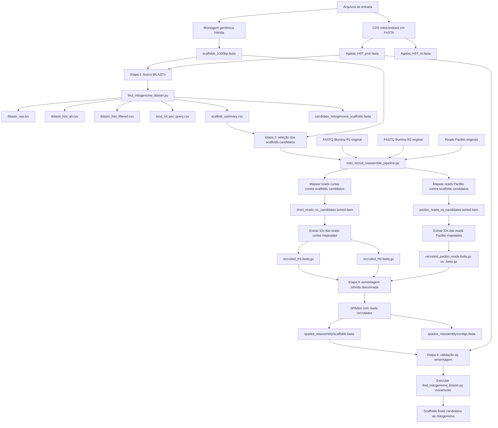

# Fluxo de Trabalho para Montagem e Recuperação de Mitogenoma

Este repositório contém um pipeline para identificar scaffolds candidatos ao genoma mitocondrial a partir de uma montagem genômica híbrida, recrutar reads associadas a esses scaffolds e realizar uma remontagem híbrida direcionada usando reads curtas Illumina e reads longas PacBio.

O fluxo foi desenvolvido para uma atividade de montagem e anotação de genomas, partindo de uma montagem gerada com SPAdes e de sequências de CDS mitocondriais em formato FASTA.

---

## Visão geral do pipeline

O pipeline é dividido em duas grandes etapas:

1. **Identificação de scaffolds candidatos ao mitogenoma**  
   O script `find_mitogenome_tblastn.py` usa proteínas de CDS mitocondriais como queries em uma busca `tBLASTn` contra a montagem genômica (`scaffolds_1000bp.fasta`). Essa etapa identifica quais scaffolds possuem evidência de genes mitocondriais.

2. **Recrutamento de reads e remontagem direcionada**  
   O script `mito_recruit_reassemble_pipeline.py` usa os scaffolds candidatos como referência para mapear as reads originais. As reads que mapeiam nesses scaffolds são extraídas e usadas em uma nova montagem híbrida direcionada com SPAdes.

A ordem correta de execução é:

```text
Montagem original + CDS mitocondriais
        ↓
tBLASTn contra scaffolds_1000bp.fasta
        ↓
Identificação de scaffolds candidatos
        ↓
Mapeamento das reads originais contra os scaffolds candidatos
        ↓
Extração das reads mapeadas
        ↓
Remontagem híbrida com reads recrutadas
        ↓
Validação dos scaffolds remontados com novo tBLASTn
```

---

## Diagrama do fluxo de trabalho



---

## Ordem de execução

Este fluxo de trabalho deve ser executado na seguinte ordem:

1. Preparar os arquivos de entrada.
2. Executar `find_mitogenome_tblastn.py`.
3. Inspecionar o arquivo `scaffold_summary.csv`.
4. Executar `mito_recruit_reassemble_pipeline.py`.
5. Inspecionar a remontagem das reads recrutadas.
6. Executar novamente `find_mitogenome_tblastn.py`, agora usando a nova montagem.
7. Avaliar os scaffolds finais candidatos ao mitogenoma.

---

## Arquivos de entrada

| Arquivo | Descrição |
|---|---|
| `scaffolds_1000bp.fasta` | Montagem genômica gerada com SPAdes. Este arquivo é usado como referência para a primeira busca `tBLASTn`. |
| `Agabis_H97_prot.fasta` | Sequências proteicas dos CDS mitocondriais. São usadas como queries no `tBLASTn`. |
| `Agabis_H97_nt.fasta` | Sequências nucleotídicas dos CDS mitocondriais. Não são usadas diretamente no `tBLASTn`, mas são úteis para comparação posterior. |
| `reads_R1.fastq.gz` | Reads curtas Illumina forward usadas na montagem híbrida original. |
| `reads_R2.fastq.gz` | Reads curtas Illumina reverse usadas na montagem híbrida original. |
| `pacbio_reads.fastq.gz` ou `pacbio_reads.fasta.gz` | Reads longas PacBio usadas na montagem híbrida original. |

---

## Dependências

O pipeline utiliza ferramentas externas de bioinformática. Elas devem estar instaladas no ambiente antes da execução.

```bash
conda install -c bioconda blast bowtie2 bwa samtools minimap2 spades
```

Dependências principais:

| Ferramenta | Uso no pipeline |
|---|---|
| `makeblastdb` | Criar banco BLAST da montagem. |
| `tblastn` | Buscar proteínas mitocondriais contra a montagem genômica. |
| `bowtie2` | Mapear reads curtas Illumina contra scaffolds candidatos. |
| `bwa` | Alternativa ao `bowtie2` para mapear reads curtas. |
| `samtools` | Manipular arquivos BAM, extrair IDs de reads e calcular cobertura. |
| `minimap2` | Mapear reads longas PacBio contra scaffolds candidatos. |
| `spades.py` | Realizar a remontagem híbrida com reads recrutadas. |
| `CAP3` | Etapa opcional para tentar unir contigs candidatos. |

O `CAP3` é opcional. O pipeline principal roda sem ele.

---

## Etapa 1: identificar scaffolds candidatos ao mitogenoma com tBLASTn

Nesta etapa, as proteínas dos CDS mitocondriais são usadas como queries contra a montagem `scaffolds_1000bp.fasta`.

```bash
python find_mitogenome_tblastn.py \
  --assembly scaffolds_1000bp.fasta \
  --cds-prot Agabis_H97_prot.fasta \
  --cds-nt Agabis_H97_nt.fasta \
  --threads 12 \
  --outdir tblastn_mitogenome_results
```

### Principais saídas da Etapa 1

| Arquivo de saída | Descrição |
|---|---|
| `tblastn_mitogenome_results/tables/tblastn_raw.tsv` | Saída bruta do `tBLASTn`, em formato tabular. |
| `tblastn_mitogenome_results/tables/tblastn_hits_all.csv` | Todos os hits encontrados pelo BLAST, com nomes de colunas. |
| `tblastn_mitogenome_results/tables/tblastn_hits_filtered.csv` | Hits filtrados por critérios mínimos de identidade, cobertura e bitscore. |
| `tblastn_mitogenome_results/tables/best_hit_per_query.csv` | Melhor hit encontrado para cada proteína mitocondrial usada como query. |
| `tblastn_mitogenome_results/tables/scaffold_summary.csv` | Resumo das evidências mitocondriais por scaffold. Este é o arquivo mais importante desta etapa. |
| `tblastn_mitogenome_results/fasta/candidate_mitogenome_scaffolds.fasta` | FASTA com scaffolds candidatos ao mitogenoma. |
| `tblastn_mitogenome_results/fasta/tblastn_hit_regions_plus_padding.fasta` | FASTA com regiões dos hits e margens adicionais. |
| `tblastn_mitogenome_results/fasta/matched_cds_proteins.fasta` | Proteínas mitocondriais que tiveram hit na montagem. |
| `tblastn_mitogenome_results/fasta/matched_cds_nucleotides.fasta` | CDS nucleotídicos correspondentes às proteínas que tiveram hit. |

O arquivo principal desta etapa é:

```bash
tblastn_mitogenome_results/tables/scaffold_summary.csv
```

Para inspecioná-lo:

```bash
column -s, -t tblastn_mitogenome_results/tables/scaffold_summary.csv | less -S
```

### Como interpretar `scaffold_summary.csv`

| Coluna | Interpretação |
|---|---|
| `sseqid` | Nome do scaffold candidato. |
| `n_hits` | Número total de hits mitocondriais naquele scaffold. |
| `n_unique_queries` | Número de CDS/proteínas mitocondriais diferentes que bateram naquele scaffold. |
| `scaffold_length_bp` | Tamanho total do scaffold. |
| `covered_bp_merged_hits` | Número de bases cobertas por hits, desconsiderando sobreposições. |
| `best_evalue` | Melhor e-value observado naquele scaffold. |
| `max_bitscore` | Maior bitscore observado naquele scaffold. |
| `queries` | Lista dos CDS/proteínas mitocondriais que bateram naquele scaffold. |

Em geral, o melhor candidato ao mitogenoma tende a ter:

```text
alto n_unique_queries
alto covered_bp_merged_hits
baixo best_evalue
alto max_bitscore
tamanho compatível com mitogenoma
```

---

## Etapa 2: recrutar reads usando scaffolds candidatos

Depois de identificar os scaffolds candidatos, o próximo passo é mapear as reads originais contra esses scaffolds e extrair apenas as reads que mapearam neles.

Esta etapa usa o script:

```bash
mito_recruit_reassemble_pipeline.py
```

### Execução com reads Illumina e PacBio

```bash
python mito_recruit_reassemble_pipeline.py \
  --assembly scaffolds_1000bp.fasta \
  --scaffold-summary tblastn_mitogenome_results/tables/scaffold_summary.csv \
  --short-r1 reads_R1.fastq.gz \
  --short-r2 reads_R2.fastq.gz \
  --pacbio-reads pacbio_reads.fastq.gz \
  --threads 20 \
  --memory 80 \
  --top-n 4 \
  --outdir mito_recruitment_pipeline_pacbio
```

Se as reads PacBio estiverem em FASTA, o comando também funciona:

```bash
python mito_recruit_reassemble_pipeline.py \
  --assembly scaffolds_1000bp.fasta \
  --scaffold-summary tblastn_mitogenome_results/tables/scaffold_summary.csv \
  --short-r1 reads_R1.fastq.gz \
  --short-r2 reads_R2.fastq.gz \
  --pacbio-reads pacbio_reads.fasta.gz \
  --threads 20 \
  --memory 80 \
  --top-n 4 \
  --outdir mito_recruitment_pipeline_pacbio
```

O script detecta automaticamente se o arquivo PacBio está em formato FASTQ ou FASTA.

---

## O que muda por serem reads PacBio?

Para reads PacBio, o pipeline usa o preset `map-pb` do `minimap2`:

```bash
minimap2 -t 20 -ax map-pb selected_candidate_scaffolds.fasta pacbio_reads.fastq.gz
```

Na remontagem, o SPAdes é executado com a opção `--pacbio`:

```bash
spades.py \
  -1 recruited_R1.fastq.gz \
  -2 recruited_R2.fastq.gz \
  --pacbio recruited_pacbio_reads.fastq.gz \
  -o spades_reassembly
```

Portanto, este pipeline não usa `--nanopore`.

---

## Saídas da Etapa 2

| Arquivo ou diretório | Descrição |
|---|---|
| `mito_recruitment_pipeline_pacbio/selected_scaffolds.csv` | Lista dos scaffolds selecionados a partir de `scaffold_summary.csv`. Por padrão, seleciona os quatro melhores. |
| `mito_recruitment_pipeline_pacbio/selected_candidate_scaffolds.fasta` | FASTA dos scaffolds candidatos usados como referência para recrutar reads. |
| `mito_recruitment_pipeline_pacbio/mapping_short/short_reads_vs_candidates.sorted.bam` | Mapeamento das reads curtas contra os scaffolds candidatos. |
| `mito_recruitment_pipeline_pacbio/mapping_short/short_reads_vs_candidates.flagstat.txt` | Estatísticas do mapeamento das reads curtas. |
| `mito_recruitment_pipeline_pacbio/mapping_pacbio/pacbio_reads_vs_candidates.sorted.bam` | Mapeamento das reads PacBio contra os scaffolds candidatos. |
| `mito_recruitment_pipeline_pacbio/mapping_pacbio/pacbio_reads_vs_candidates.flagstat.txt` | Estatísticas do mapeamento das reads PacBio. |
| `mito_recruitment_pipeline_pacbio/recruited_reads/mapped_short_read_ids.txt` | IDs das reads curtas que mapearam nos scaffolds candidatos. |
| `mito_recruitment_pipeline_pacbio/recruited_reads/mapped_pacbio_read_ids.txt` | IDs das reads PacBio que mapearam nos scaffolds candidatos. |
| `mito_recruitment_pipeline_pacbio/recruited_reads/recruited_R1.fastq.gz` | Reads R1 recrutadas para remontagem. |
| `mito_recruitment_pipeline_pacbio/recruited_reads/recruited_R2.fastq.gz` | Reads R2 recrutadas para remontagem. |
| `mito_recruitment_pipeline_pacbio/recruited_reads/recruited_pacbio_reads.fastq.gz` | Reads PacBio recrutadas, se o arquivo original estiver em FASTQ. |
| `mito_recruitment_pipeline_pacbio/recruited_reads/recruited_pacbio_reads.fasta.gz` | Reads PacBio recrutadas, se o arquivo original estiver em FASTA. |
| `mito_recruitment_pipeline_pacbio/recruited_reads/recruited_short_reads_summary.csv` | Número de pares Illumina analisados e recrutados. |
| `mito_recruitment_pipeline_pacbio/recruited_reads/recruited_pacbio_reads_summary.csv` | Número de reads PacBio analisadas e recrutadas. |
| `mito_recruitment_pipeline_pacbio/coverage/coverage_by_scaffold.csv` | Cobertura média e porcentagem de cobertura dos scaffolds candidatos. |
| `mito_recruitment_pipeline_pacbio/coverage/depth_per_base.tsv` | Cobertura base a base dos scaffolds candidatos. |
| `mito_recruitment_pipeline_pacbio/spades_reassembly/scaffolds.fasta` | Nova montagem feita com as reads recrutadas. Este é o principal resultado da Etapa 2. |
| `mito_recruitment_pipeline_pacbio/spades_reassembly/contigs.fasta` | Contigs da nova montagem feita com as reads recrutadas. |
| `mito_recruitment_pipeline_pacbio/cap3/` | Saídas opcionais do CAP3, se a opção `--run-cap3` for usada. |

---

## Seleção automática de scaffolds

Por padrão, o pipeline seleciona os quatro melhores scaffolds:

```bash
--top-n 4
```

Essa seleção considera:

1. Maior número de CDS/proteínas mitocondriais diferentes no scaffold.
2. Maior cobertura somada dos hits.
3. Menor e-value.
4. Maior bitscore.
5. Maior número total de hits.

Para selecionar os dois melhores scaffolds:

```bash
--top-n 2
```

Para selecionar os dez melhores scaffolds:

```bash
--top-n 10
```

---

## Seleção manual de scaffolds

Também é possível escolher manualmente os scaffolds que serão usados para recrutar reads.

Primeiro, inspecione:

```bash
column -s, -t tblastn_mitogenome_results/tables/scaffold_summary.csv | less -S
```

Depois, execute o pipeline informando os nomes dos scaffolds separados por vírgula:

```bash
python mito_recruit_reassemble_pipeline.py \
  --assembly scaffolds_1000bp.fasta \
  --scaffold-summary tblastn_mitogenome_results/tables/scaffold_summary.csv \
  --short-r1 reads_R1.fastq.gz \
  --short-r2 reads_R2.fastq.gz \
  --pacbio-reads pacbio_reads.fastq.gz \
  --manual-scaffolds NODE_12_length_45000_cov_80,NODE_33_length_12000_cov_65 \
  --threads 20 \
  --memory 80 \
  --outdir mito_recruitment_pipeline_manual_pacbio
```

---

## Rodar apenas o recrutamento, sem remontar

Para testar apenas o mapeamento e a extração das reads, use a opção `--skip-assembly`:

```bash
python mito_recruit_reassemble_pipeline.py \
  --assembly scaffolds_1000bp.fasta \
  --scaffold-summary tblastn_mitogenome_results/tables/scaffold_summary.csv \
  --short-r1 reads_R1.fastq.gz \
  --short-r2 reads_R2.fastq.gz \
  --pacbio-reads pacbio_reads.fastq.gz \
  --threads 20 \
  --top-n 4 \
  --skip-assembly \
  --outdir mito_recruitment_pipeline_pacbio_test
```

Depois, inspecione as estatísticas de mapeamento:

```bash
cat mito_recruitment_pipeline_pacbio_test/mapping_short/short_reads_vs_candidates.flagstat.txt
cat mito_recruitment_pipeline_pacbio_test/mapping_pacbio/pacbio_reads_vs_candidates.flagstat.txt
```

E veja quantas reads foram recrutadas:

```bash
cat mito_recruitment_pipeline_pacbio_test/recruited_reads/recruited_short_reads_summary.csv
cat mito_recruitment_pipeline_pacbio_test/recruited_reads/recruited_pacbio_reads_summary.csv
```

---

## Etapa opcional com CAP3

O CAP3 pode ser usado opcionalmente para tentar unir contigs/scaffolds candidatos ao mitogenoma.

```bash
python mito_recruit_reassemble_pipeline.py \
  --assembly scaffolds_1000bp.fasta \
  --scaffold-summary tblastn_mitogenome_results/tables/scaffold_summary.csv \
  --short-r1 reads_R1.fastq.gz \
  --short-r2 reads_R2.fastq.gz \
  --pacbio-reads pacbio_reads.fastq.gz \
  --threads 20 \
  --memory 80 \
  --top-n 4 \
  --run-cap3 \
  --outdir mito_recruitment_pipeline_pacbio_cap3
```

Esta etapa deve ser tratada como complementar. O núcleo do workflow é:

```text
selecionar scaffolds mitocondriais
mapear reads
extrair reads mapeadas
remontar com SPAdes usando --pacbio
```

---

## Etapa 3: validar a remontagem direcionada

Após a remontagem com reads recrutadas, o principal arquivo a ser avaliado é:

```bash
mito_recruitment_pipeline_pacbio/spades_reassembly/scaffolds.fasta
```

Execute novamente o script `find_mitogenome_tblastn.py`, agora usando a nova montagem como referência:

```bash
python find_mitogenome_tblastn.py \
  --assembly mito_recruitment_pipeline_pacbio/spades_reassembly/scaffolds.fasta \
  --cds-prot Agabis_H97_prot.fasta \
  --cds-nt Agabis_H97_nt.fasta \
  --threads 12 \
  --outdir tblastn_after_pacbio_recruitment
```

Depois, inspecione:

```bash
column -s, -t tblastn_after_pacbio_recruitment/tables/scaffold_summary.csv | less -S
```

Espera-se que a remontagem direcionada concentre os hits mitocondriais em menos scaffolds, idealmente em um scaffold dominante.

---

## Execução completa resumida

```bash
# 1. Identificar scaffolds candidatos ao mitogenoma
python find_mitogenome_tblastn.py \
  --assembly scaffolds_1000bp.fasta \
  --cds-prot Agabis_H97_prot.fasta \
  --cds-nt Agabis_H97_nt.fasta \
  --threads 12 \
  --outdir tblastn_mitogenome_results

# 2. Inspecionar o resumo dos scaffolds
column -s, -t tblastn_mitogenome_results/tables/scaffold_summary.csv | less -S

# 3. Recrutar reads e remontar com Illumina + PacBio
python mito_recruit_reassemble_pipeline.py \
  --assembly scaffolds_1000bp.fasta \
  --scaffold-summary tblastn_mitogenome_results/tables/scaffold_summary.csv \
  --short-r1 reads_R1.fastq.gz \
  --short-r2 reads_R2.fastq.gz \
  --pacbio-reads pacbio_reads.fastq.gz \
  --threads 20 \
  --memory 80 \
  --top-n 4 \
  --outdir mito_recruitment_pipeline_pacbio

# 4. Validar a nova montagem direcionada
python find_mitogenome_tblastn.py \
  --assembly mito_recruitment_pipeline_pacbio/spades_reassembly/scaffolds.fasta \
  --cds-prot Agabis_H97_prot.fasta \
  --cds-nt Agabis_H97_nt.fasta \
  --threads 12 \
  --outdir tblastn_after_pacbio_recruitment

# 5. Inspecionar os scaffolds finais candidatos ao mitogenoma
column -s, -t tblastn_after_pacbio_recruitment/tables/scaffold_summary.csv | less -S
```

---

## Resultado esperado

Ao final do workflow, espera-se obter uma remontagem direcionada na qual os genes mitocondriais estejam concentrados em menos scaffolds do que na montagem original.

Um bom scaffold candidato ao mitogenoma deve apresentar:

- vários CDS mitocondriais diferentes mapeados;
- baixos valores de e-value;
- altos valores de bitscore;
- boa cobertura por reads Illumina e PacBio;
- tamanho compatível com um mitogenoma;
- menor fragmentação em relação à montagem original.

Os principais arquivos finais são:

```bash
mito_recruitment_pipeline_pacbio/spades_reassembly/scaffolds.fasta
tblastn_after_pacbio_recruitment/tables/scaffold_summary.csv
```

---

## Observações importantes

- O script `find_mitogenome_tblastn.py` deve ser executado antes do `mito_recruit_reassemble_pipeline.py`.
- O arquivo `scaffold_summary.csv` é a ponte entre as duas etapas principais do pipeline.
- Como as long reads deste projeto são PacBio, o pipeline usa `minimap2 -ax map-pb` e `spades.py --pacbio`.
- A etapa com CAP3 é opcional e não substitui a remontagem com reads recrutadas.
- Após a remontagem, é necessário validar novamente os scaffolds com `tBLASTn`.
